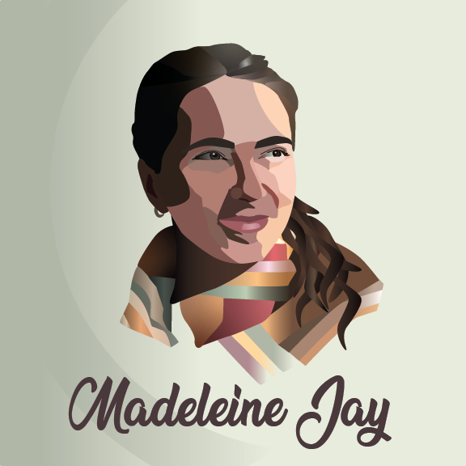

# Madeleine Jay Resume 
## Graphic Designer
[LinkedIn](https://www.linkedin.com/in/madeleine-j-9995b61b5/) | +1 (123) 456 7899

### Professional Summary
Creative graphic design and marketing professional with hands-on experience in digital design, content creation, and
social media strategy. I craft engaging visuals that maintain brand consistency and connect with audiences, combining
design thinking and strategic storytelling to deliver impact. Resourceful, organized, and eager to learn, I thrive in
collaborative, fast-paced creative environments.

### Key Skills
Adobe Creative Suite (Illustrator, Photoshop, InDesign) • Typography • Colour Theory • Branding • Social Media
Design • Creative Thinking • Communication • Time Management • Adaptability • Attention to Detail • Figma • After Effects (learning) • Premiere Pro (learning)

###  Professional Experience
#### Marketing Specialist, Credit Canada, North York, ON | May 2025 – Today
*I design and execute visually engaging content across digital and print, combining creative thinking with strategy to
grow audiences and maintain a consistent brand presence.*
* Design in-house creative assets, including hero images, social media creatives, digital ads, website pop-ups,
and printed materials
* Pitch design concepts to team members and leadership, incorporating feedback to refine visuals
* Contribute to and execute integrated marketing and social media strategies to increase brand awareness,
engagement, and conversions
* Create social media content aligned with brand identity and grow social media audience of 25,000+
(Instagram +143%, TikTok +348.5%)
* Build and maintain strong relationships with 25+ micro to mega-influencers, partnering to develop
campaigns that enhance brand visibility and trust
* Curate and distribute monthly newsletters to 30,000+ subscribers, maintaining consistent visual and
messaging standards

#### Marketing Coordinator, Credit Canada, North York, ON | August 2023 – May 2025
*I worked closely with my team to bring creative ideas and campaigns to life, while staying curious, adaptable, and
always open to learning.*
* Assisted with ongoing marketing and creative projects, contributing ideas and helping execute campaigns
* Designed social media content, including infographics, carousels, reels, and captions

### Volunteer Experience
#### Chair of the Board, Telecare Distress Line of Greater Simcoe, Orillia, ON | May 2023 – May 2025
* Led five board members to advance the non-profit’s mission, fostering a collaborative environment
* Directed and supported one part-time staff member and 20+ volunteers to develop and implement strategic
initiatives improving service delivery and sustainability

### Education
**Advanced Diploma, Graphic Design (Second Year),** Humber Polytechnic, ON

**Honours Bachelor of Science, Psychology,** University of Toronto, ON (2023)

